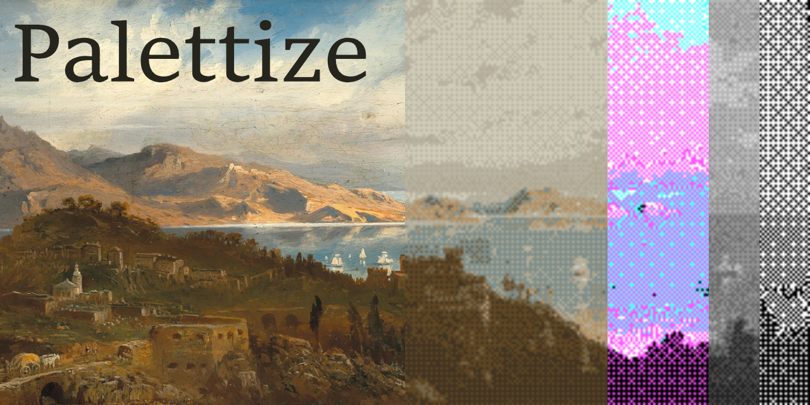

# palettize

[](https://github.com/dp88/palettize/actions/workflows/ci.yml)
[](https://crates.io/crates/palettize-cli)
[](https://docs.rs/palettize)
[](https://blog.rust-lang.org/2025/02/20/Rust-1.85.0/)
[](#license)

`palettize` turns full-color images into ordered Bayer-dithered images with a palette you choose.

## Quick start

Install the command-line tool:

```sh
cargo install palettize-cli
```

Then dither an image with the default black-and-white palette:

```sh
palettize --input photo.png --output photo-dithered.png
```

To work from a checkout instead, run:

```sh
cargo install --path crates/palettize-cli
```

Use `palettize --help` to see every option.

## Capabilities

- Use a grayscale palette, comma-separated colors, or a palette file.
- Extract a palette with median cut or k-means++ clustering.
- Control Bayer matrix size and dither strength.
- Use the reusable [`palettize`](https://crates.io/crates/palettize) library in Rust applications.

## Documentation

- [Library API on docs.rs](https://docs.rs/palettize)
- [Library package guide](crates/palettize/README.md)
- [CLI package guide](crates/palettize-cli/README.md)
- [Changelog](CHANGELOG.md)
- [Release guide](RELEASING.md)

## Requirements

Building from source requires Rust 1.85 or later.

## License

Licensed under either of [MIT](LICENSE-MIT) or [Apache-2.0](LICENSE-APACHE), at your option.

Banner: *A View of the Bay of Santa Margherita* by Pieter Francis Peters,
public domain. Full artwork and test-image credits are in [art/CREDITS.md](art/CREDITS.md).
